<div align="center">

# 🌾 AgroSpectra

### *AI-Powered Precision Agriculture Platform*

[](https://www.python.org/)
[](https://streamlit.io/)
[](https://www.tensorflow.org/)
[](LICENSE)

*Integrating satellite imagery, real-time environmental data, and agricultural intelligence for smart farming decisions*

[🚀 Get Started](#-quick-start) • [📖 Documentation](#-documentation) • [🎥 Demo](#-demo) • [🤝 Contributing](#-contributing)


</div>

## 🌍 Overview

**AgroSpectra** is a comprehensive 9-tier WebGIS platform that revolutionizes precision agriculture by combining:

<table>
<tr>
<td width="33%" align="center">

🛰️ **Satellite Intelligence**
<br>
<sub>Sentinel-2 multispectral analysis with NDVI, NDWI, and EVI indices</sub>

</td>
<td width="33%" align="center">

🌡️ **Real-Time Monitoring**
<br>
<sub>Live weather, AQI tracking, and environmental data integration</sub>

</td>
<td width="33%" align="center">

🤖 **AI-Powered Analytics**
<br>
<sub>MobileNetV2 + LSTM models for crop health and pest prediction</sub>

</td>
</tr>
</table>

### 🌟 Global Coverage with India-Enhanced Mode

Works worldwide with **Sentinel Hub** + **OpenWeatherMap**. Automatically activates **ICAR (Indian Council of Agricultural Research)** integration when analyzing locations in India for enhanced regional insights.


## ✨ Key Features

<details open>
<summary><b>🌐 Core Monitoring (Global)</b></summary>

- ✅ **Real-time crop health classification** - Healthy/Stressed/Diseased detection
- 📊 **Vegetation indices analysis** - NDVI, NDWI, EVI calculations
- 🐛 **Pest outbreak prediction** - 7-day forecast with ML models
- 🗺️ **Interactive geospatial maps** - Folium-powered visualization
- 📈 **Time series analysis** - Historical trend tracking
- 📄 **Automated reporting** - PDF export with actionable insights

</details>

<details>
<summary><b>🇮🇳 India-Enhanced Mode (Automatic)</b></summary>

When analyzing Indian locations, AgroSpectra automatically provides:

- 🐛 **Regional pest alerts** - ICAR-validated warnings by state/district
- 🌱 **Crop recommendations** - State-specific varieties and practices
- 🏞️ **Soil health data** - District-level parameters from Soil Health Cards
- ☁️ **Weather advisories** - IMD-ICAR agromet guidance
- 📊 **Yield benchmarks** - Compare with state averages
- 💰 **Dynamic pricing** - Location and season-aware crop valuations

</details>

<details>
<summary><b>🔬 Environmental Analytics</b></summary>

- 💨 **Air Quality Index (AQI)** - PM2.5, PM10, O₃, NO₂, SO₂, CO monitoring
- 🌡️ **Weather integration** - Temperature, humidity, precipitation, wind
- 📉 **AQI impact analysis** - Quantifies pollution effects on crops (-10%) and soil (-15%)
- 🌍 **Multi-source data fusion** - Sentinel Hub, OpenWeatherMap, MOSDAC, ICAR

</details>


## 🎥 Demo

<div align="center">

### 📹 Watch AgroSpectra in Action

[](https://drive.google.com/file/d/1Kpuo-bUJBptUAmqn-vQq7UhSPFd8a7Lm/view?usp=sharing)

*Click above to view a comprehensive demonstration of AgroSpectra's capabilities*

</div>


## 🏗️ Architecture

### Nine-Tier System Design

```mermaid
graph TB
    A[👤 User Interface Layer] --> B[📡 Data Acquisition Layer]
    B --> C[🗺️ Geospatial Harmonization Layer]
    C --> D[⚙️ Feature Engineering Layer]
    D --> E[🤖 AI Modeling Layer]
    E --> F[💾 Data Storage Layer]
    F --> G[📊 Web GIS Dashboard]
    G --> H[🚨 Alerts & Reporting Layer]
    H --> I[🔄 Feedback & Retraining Layer]
    I --> E
```



<details>
<summary><b>Layer Details</b></summary>

| Layer | Technology | Purpose |
|-------|-----------|---------|
| **Tier 1** | Streamlit | Interactive web interface with GPS integration |
| **Tier 2** | REST APIs | Sentinel Hub, OpenWeatherMap, MOSDAC, ICAR |
| **Tier 3** | GDAL/Rasterio | CRS normalization, cloud masking, indices |
| **Tier 4** | Pandas/NumPy | Temporal interpolation, anomaly detection |
| **Tier 5** | TensorFlow/Keras | MobileNetV2 + LSTM + Fusion engine |
| **Tier 6** | SQLite/GeoPackage | Persistent storage and caching |
| **Tier 7** | Folium/Plotly | Interactive maps and visualizations |
| **Tier 8** | SMTP/SMS | Rule-based alerts and PDF reports |
| **Tier 9** | Active Learning | Continuous model improvement |

</details>


## 🚀 Quick Start

### Prerequisites

- **Python** 3.9 or higher
- **pip** package manager
- **GDAL** 3.4+ for geospatial operations

### Installation

```powershell
# 1. Clone the repository
git clone https://github.com/MananGeria/AgroSpectra.git
cd AgroSpectra

# 2. Create virtual environment
python -m venv venv
.\venv\Scripts\Activate.ps1

# 3. Install dependencies
pip install --upgrade pip
pip install -r requirements.txt

# 4. Install GDAL (Windows - choose one method)
# Option A: OSGeo4W installer (recommended)
# Download from: https://trac.osgeo.org/osgeo4w/

# Option B: Conda
# conda install -c conda-forge gdal

# 5. Configure environment
cp config\config.example.yaml config\config.yaml
# Edit config.yaml with your API credentials

# 6. Initialize database
python scripts/initialize_database.py

# 7. Launch application
streamlit run src/dashboard/app.py
```

### 🔑 API Configuration

<details>
<summary><b>Required API Keys</b></summary>

**Sentinel Hub** (Required)
- Register at: [Sentinel Hub](https://www.sentinel-hub.com/)
- Free tier: 30,000 processing units/month
- Add to `config/config.yaml`

**OpenWeatherMap** (Required)
- Register at: [OpenWeatherMap](https://openweathermap.org/api)
- Free tier: 1,000 calls/day
- Add to `config/config.yaml`

**MOSDAC** (Optional - Indian subcontinent)
- Register at: [MOSDAC](https://www.mosdac.gov.in/)
- Request data access

**ICAR** (Optional - Real-time Indian data)
- Apply at: [ICAR Data Portal](https://data.icar.gov.in/)
- Approval: 7-15 days

</details>


## 📖 Documentation

### Usage Workflow

```mermaid
graph LR
    A[🌍 Select Location] --> B[🌾 Choose Crop]
    B --> C[📅 Set Date Range]
    C --> D[▶️ Run Analysis]
    D --> E[📊 View Results]
    E --> F[📄 Export Report]
    F --> G[💬 Provide Feedback]
```



### Analysis Outputs

| Output | Description | Update Frequency |
|--------|-------------|------------------|
| **Crop Health Score** | 0-100% with AQI penalties | Real-time |
| **Soil Quality Index** | Regional profiles + air quality impact | 7 days |
| **Pest Risk Assessment** | Severity levels with confidence | Daily |
| **Yield Prediction** | Estimated tons/hectare | Seasonal |
| **Economic Valuation** | Market-aware gross value | Daily |
| **Environmental Metrics** | Temperature, humidity, AQI | Hourly |

### 📍 Location Input Methods

<table>
<tr>
<td align="center" width="33%">

**🔍 Search by Name**
<br>
<sub>Type any city, district, or place name</sub>

</td>
<td align="center" width="33%">

**📍 Manual Coordinates**
<br>
<sub>Enter latitude/longitude directly</sub>

</td>
<td align="center" width="33%">

**🗺️ Draw on Map**
<br>
<sub>Interactive polygon selection</sub>

</td>
</tr>
</table>


## 🛠️ Technology Stack

<div align="center">

### Backend


### Frontend


### Data Sources


</div>


## 📊 Coverage & Data

### 🌏 Regional Support

**17 Indian States** with enhanced ICAR integration:
- **Northern**: Punjab, Haryana, Uttar Pradesh, Himachal Pradesh
- **Western**: Maharashtra, Gujarat, Rajasthan
- **Southern**: Karnataka, Tamil Nadu, Andhra Pradesh, Telangana, Kerala
- **Eastern**: West Bengal, Bihar, Odisha
- **Central**: Madhya Pradesh, Chhattisgarh

**12+ Supported Crops**:
Wheat • Rice • Cotton • Sugarcane • Maize • Soybean • Potato • Onion • Tomato • Groundnut • Pulses • Millets

### 📡 Data Sources

| Source | Purpose | Frequency | Coverage |
|--------|---------|-----------|----------|
| **Sentinel-2** | Satellite imagery | 5 days | Global |
| **OpenWeatherMap** | Weather + AQI | Hourly | Global |
| **ICAR** | Pest alerts | Real-time | India |
| **Soil Health Cards** | Soil parameters | Static | India |
| **Nominatim** | Geocoding | On-demand | Global |


## 🐳 Docker Deployment

```powershell
# Build and start services
docker-compose up -d

# View logs
docker-compose logs -f web

# Stop services
docker-compose down
```

**Access Points:**
- 🌐 Dashboard: `http://localhost:8501`
- 📚 API Docs: `http://localhost:8000/docs`
- 🗄️ Redis: `localhost:6379`


## 🧪 Testing

```powershell
# Run all tests
pytest tests/ --cov=src

# Test specific modules
pytest tests/test_acquisition.py
pytest tests/test_models.py

# Test ICAR integration
python scripts/test_icar_api.py

# Test AQI system
python test_aqi.py
```


## 🔮 Roadmap

### Version 1.1 (Q1 2026)
- [ ] 📱 Mobile app (React Native)
- [ ] 🌐 Multi-language support (Hindi, Tamil, Telugu)
- [ ] 💧 Irrigation scheduling module
- [ ] 📧 Email/SMS notification system

### Version 2.0 (Q3 2026)
- [ ] 🚁 Drone imagery integration
- [ ] 🤖 AI chatbot for farmer queries
- [ ] 📊 Multi-field comparison dashboard
- [ ] 🔗 Blockchain supply chain tracking

### Future Vision
- [ ] 🥽 AR field scanner app
- [ ] 🌐 Community forum platform
- [ ] 🏦 Crop insurance recommendations
- [ ] 🔌 IoT sensor integration


## 🤝 Contributing

Contributions are what make the open-source community amazing! Any contributions you make are **greatly appreciated**.

```bash
# Fork the repo and create your branch
git checkout -b feature/AmazingFeature

# Commit your changes
git commit -m 'Add some AmazingFeature'

# Push to the branch
git push origin feature/AmazingFeature

# Open a Pull Request
```

**Development Guidelines:**
- Follow PEP 8 style guide
- Add comprehensive docstrings
- Update tests for new features
- Update documentation as needed


## 📈 Performance

### ⚡ Response Times
- Location search: **< 1 second**
- AQI fetch: **1-2 seconds**
- Satellite processing: **5-10 seconds**
- Full analysis: **10-15 seconds**

### 💾 Caching Strategy
- Raw satellite imagery: **30 days**
- Processed features: **7 days**
- Weather data: **24 hours**
- Database queries: **Redis**


## 🙏 Acknowledgments

<div align="center">

Special thanks to:

**🛰️ European Space Agency** - Sentinel-2 satellite data
<br>
**🚀 ISRO** - MOSDAC regional data products
<br>
**🌾 ICAR** - Agricultural research databases
<br>
**☁️ OpenWeatherMap** - Weather and air quality data
<br>
**🌍 OpenStreetMap** - Geocoding services
<br>
**💻 Open Source Community** - Amazing libraries and tools

</div>


## 📄 License

This project is licensed under the **MIT License** - see the [LICENSE](LICENSE) file for details.


## 📧 Contact & Support

<div align="center">

[](https://github.com/MananGeria)
[](https://github.com/MananGeria/AgroSpectra/issues)
[](https://github.com/MananGeria/AgroSpectra/discussions)

**If you find AgroSpectra useful, please consider giving it a ⭐!**


*Empowering sustainable agriculture through technology*

</div>